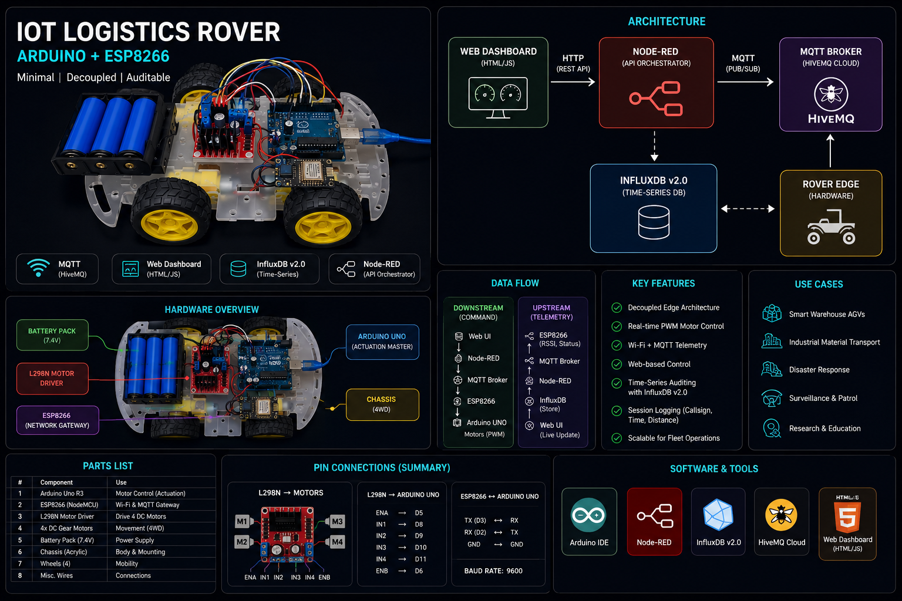

# Decoupled IoT Logistics Rover with Time-Series Auditing

> **Using Node-RED, InfluxDB v2.0, MQTT & ESP8266/Arduino Edge Computing**

## Project Overview

### Problem Statement

In industrial automation and smart logistics, traditional remote-controlled vehicles suffer from severe limitations. They rely on localized, distance-limited communication (like Bluetooth) and lack centralized, permanent auditing capabilities. Furthermore, standard IoT implementations often force a single microcontroller to handle both physical motor actuation and heavy network traffic. This leads to "serial choking" or system crashes, making them completely unviable for scaling into massive, high-frequency enterprise fleets (like AGVs in an Amazon warehouse).

### Solution Statement

The **Decoupled IoT Logistics Rover** solves this bottleneck by implementing a commercial-grade, multi-tiered edge-to-cloud architecture. It is not merely a remote-controlled car; it is a scalable fleet management prototype. By separating physical motor control from wireless network handling, and routing all data through a dedicated API middleware (Node-RED) into a Time-Series Database (InfluxDB), the system allows any authorized operator to control the vehicle globally via a web browser while maintaining a permanent, unalterable ledger of mission telemetry and operator actions.

-----

## Core Concept & Value

### Why Decoupled Architecture? (Core Innovation)

Traditional robotic approaches often use one chip to do everything, resulting in stuttering motors and dropped Wi-Fi packets. This project leverages a **Decoupled Edge Architecture** because industrial reliability requires different hardware for different "modes of operation."

  * **Separation of Concerns:** An Arduino Uno is dedicated purely to real-time physical motor control, while a NodeMCU (ESP8266) acts exclusively as the network gateway. If the Wi-Fi lags, the motor controller doesn't freeze.
  * **Digital Twin Simulation:** Heavy calculations (like tracking odometry) are offloaded from the physical hardware to a digital twin running on the frontend web dashboard, preventing voltage brownouts on the microcontrollers.
  * **Infinite Scalability:** By using an MQTT cloud broker instead of direct IP-to-IP connections, this exact same architecture can be scaled from one rover to a swarm of 1,000 rovers without changing the backend logic.

### Key Features

  * **Master-Slave Edge Computing:** Implements a strict serial handshake between the ESP8266 (Network Master) and Arduino Uno (Actuation Slave) for zero-latency physical movement.
  * **Bi-Directional MQTT Telemetry:** Utilizes a HiveMQ public cloud broker with QoS 0 to ensure ultra-fast, lightweight data transmission over congested networks.
  * **Time-Series Auditing:** Integrates InfluxDB v2.0 to natively capture high-frequency hardware metrics (RSSI signal strength) and secure operator session logs (Callsign, Duration, Distance).
  * **Device-Agnostic Web Dashboard:** A responsive HTML/JS interface that requires no app installation, featuring interactive SVG speed gauges and a mathematical virtual radar map.
  * **"Frontend Simulation" Engine:** An asynchronous JavaScript loop calculates theoretical distance and position locally, saving massive amounts of network bandwidth.

-----

## Architecture

## Architectural Diagram

### Design Philosophy

The architecture of this IoT system is built on the principles of Asynchronous Communication, Hardware Isolation, and Immutable Auditing.

  * **Edge Isolation:** The microcontrollers only know about the MQTT broker; they are completely isolated from the database and the web server.
  * **Centralized Orchestration:** A Node-RED server acts as the API Gateway, catching HTTP requests from the browser, translating them to MQTT for the rover, and injecting the results into the database.
  * **High-Frequency Optimization:** Relational databases crash under rapid sensor data. This architecture uses a Time-Series Database specifically engineered for chronological IoT data streams.

### High-Level Component Breakdown

**1. The API Orchestrator (Node-RED)**
The "middleman" of the operation. It listens for web clicks via custom HTTP POST/GET endpoints, formats the payloads, and routes traffic between the cloud broker and the database.

**2. The Hardware Edge (The Rover)**
  * **Network Gateway (ESP8266):** Connects to Wi-Fi, subscribes to MQTT commands, and polls internal signal strength (RSSI) every 2 seconds.
  * **Actuation Controller (Arduino Uno):** Parses serial commands from the ESP8266 and outputs precise 8-bit PWM signals to the L298N motor driver.

**3. The Telemetry Vault (InfluxDB)**
  * **Hardware Stats (`rover_stats`):** A continuous flight-recorder logging network health.
  * **Session Logs (`session_logs`):** An unalterable security ledger recording who drove the rover, for how long, and how far.

**4. The Presentation Layer (Web Dashboard)**
  * **Vanilla JS/HTML/CSS Frontend:** A lightning-fast, dark-mode command center that uses the `fetch()` API to talk to Node-RED, dynamically updating UI elements without page refreshes.

### Project Structure
```text
IOT-LOGISTICS-ROVER/
├── arduino_edge_controller/  # Physical actuation
│   └── motor_control.ino     # Arduino L298N PWM logic
│
├── esp8266_mqtt_gateway/     # Network & Telemetry
│   └── wifi_mqtt_bridge.ino  # NodeMCU Wi-Fi and PubSubClient logic
│
├── node_red_middleware/      # API & Routing
│   └── flows.json            # Node-RED canvas export
│
├── frontend_dashboard/       # User Interface
│   ├── index.html            # Main command center UI
│   ├── style.css             # Dark-mode styling
│   └── script.js             # Async API calls and Odometry Simulation

└── README.md

```

---

## Workflow

The system follows an asynchronous, bidirectional pipeline:

1. **Command Execution (Downstream):** User clicks "Forward" $\rightarrow$ Web UI sends `POST /move` to Node-RED $\rightarrow$ Node-RED publishes to MQTT $\rightarrow$ NodeMCU receives payload $\rightarrow$ Arduino drives motors.
2. **Telemetry Polling (Upstream):** NodeMCU reads Wi-Fi RSSI $\rightarrow$ Publishes to MQTT $\rightarrow$ Node-RED catches data $\rightarrow$ InfluxDB stores record & Web UI updates signal bars.
3. **Session Auditing:** User clicks "Logout" $\rightarrow$ Web UI calculates total trip distance $\rightarrow$ Sends JSON payload to Node-RED $\rightarrow$ Node-RED injects secure record into InfluxDB `session_logs`.

---

## Essential Tools and Utilities

**Hardware & Microcontrollers**

* Arduino Uno R3 & L298N Motor Driver
* NodeMCU ESP8266 (Wi-Fi Module)
* C++ / Arduino IDE (Libraries: `SoftwareSerial`, `ESP8266WiFi`, `PubSubClient`)

**Middleware & Database**

* **Node-RED:** Visual API builder and message broker.
* **InfluxDB v2.0:** Time-Series Database with Flux querying.
* **HiveMQ:** Public cloud MQTT Broker (`broker.hivemq.com`).

**Frontend**

* HTML5, CSS3, Vanilla JavaScript (Fetch API)

---

## Installation

### Prerequisites

* Arduino IDE (with ESP8266 board definitions installed)
* Node.js & Node-RED installed locally
* InfluxDB v2.0 Windows/Mac Binaries
* Local Wi-Fi Network

### Step-by-Step Setup

**1. Clone the Repository**

```bash
git clone [https://github.com/YourUsername/iot-logistics-rover.git](https://github.com/YourUsername/iot-logistics-rover.git)
cd iot-logistics-rover

```

**2. Hardware Edge Setup**

* Open `arduino_edge_controller/motor_control.ino` in Arduino IDE and flash to the Arduino Uno.
* Open `esp8266_mqtt_gateway/wifi_mqtt_bridge.ino`, update your `ssid` and `password`, and flash to the NodeMCU.
* Wire the NodeMCU TX/RX to the Arduino RX/TX (Pins 2 & 3).

**3. Database Setup**

* Launch `influxd.exe` from your terminal.
* Open `http://localhost:8086`, create an Organization (`MyCollege`), and a Bucket (`rover_data`).
* Generate an All-Access API Token.

**4. Middleware Setup**

* Launch Node-RED by typing `node-red` in a new terminal.
* Open `http://localhost:1880`.
* Import the `node_red_middleware/flows.json` file.
* Update the InfluxDB nodes in the flow with your new API Token and click **Deploy**.

### Running the Application

Simply open the `index.html` file inside the `frontend_dashboard` folder using any modern web browser. Log in with an operator callsign to begin transmitting telemetry to your local backend!

---

## Conclusion & Value

The **Decoupled IoT Logistics Rover** proves that enterprise-grade security, logging, and real-time actuation can be achieved on low-cost hardware by utilizing the correct architectural framework. By separating the network stack from the physical actuators and utilizing a Time-Series Database for high-frequency logs, we have built a highly fault-tolerant system.

For industrial engineers and logistics managers, this prototype serves as a direct, scalable blueprint for managing fleets of Automated Guided Vehicles (AGVs) in smart warehouses, disaster response scenarios, and perimeter surveillance operations.

```

```